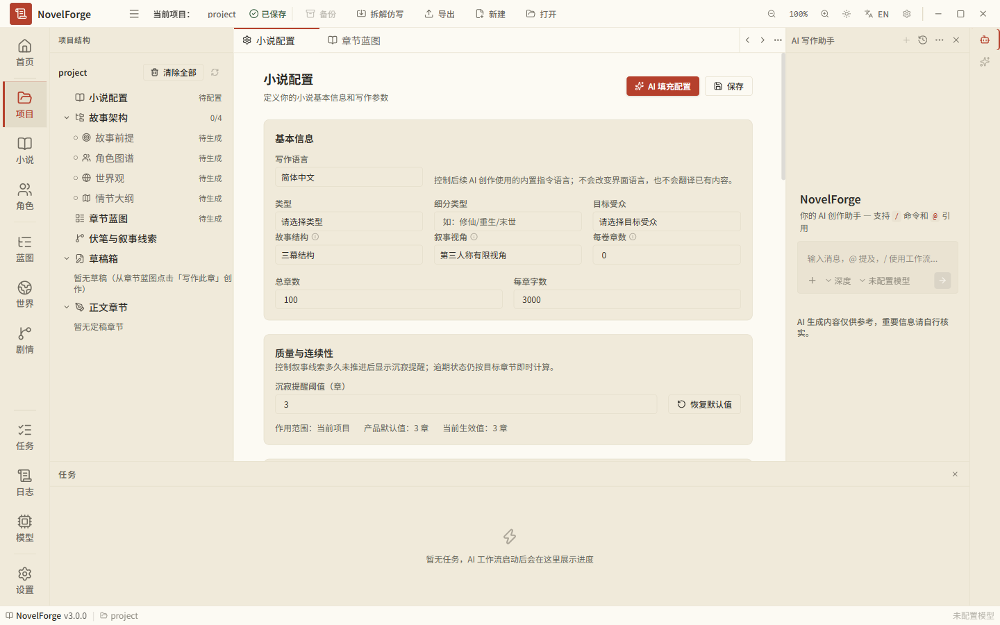
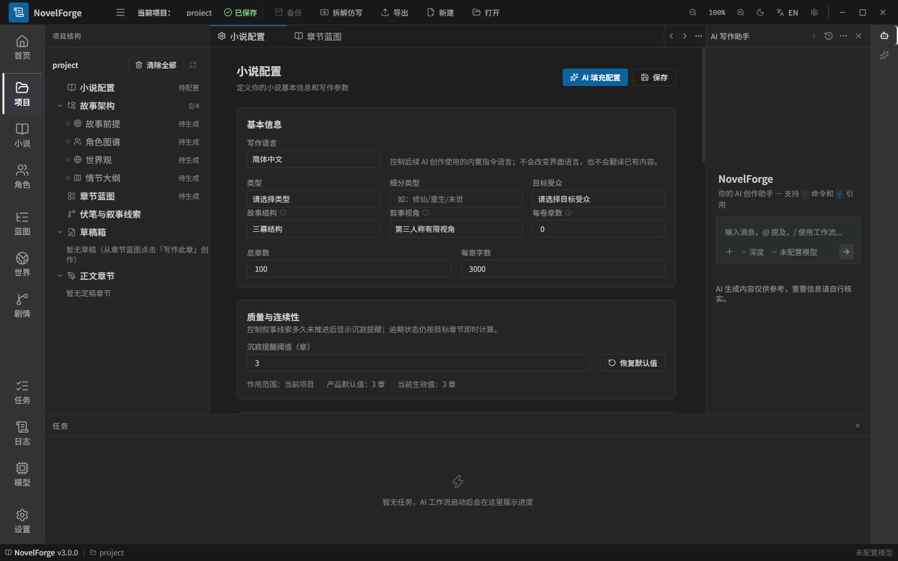

# NovelForge — 二次元轻小说创作工作台

[](https://github.com/nikaidohirol/NovelForge/actions/workflows/ci.yml)

NovelForge 是一款面向二次元轻小说作者的本地优先桌面创作工具：从世界观、角色卡到章节创作、互动模拟与审稿，覆盖轻小说创作全流程。

## 核心特性

### 多 Agent 互动模拟生成

让角色在场景中"活"起来：

- **角色自主互动**：选择 2–6 名角色与一个场景，角色按各自性格、目标与当前状态轮流行动，而非由大纲逐句编排。
- **导演控场**：导演 Agent 周期性评估剧情张力（关系变化、目标冲突、秘密压力、事件新颖度四维加权），必要时注入外部事件推动剧情。
- **知识边界硬约束**：每个角色拥有自己的"秘密"。发言前进行秘密越界扫描，命中即拦截并要求重述，重述仍越界则降级为沉默——角色永远不会说出它不该知道的信息。
- **互动日志成稿**：完整的互动记录（含越界与干预事件）自动重写为符合轻小说文风的章节草稿。

### 二次元角色卡

在传统角色卡（外貌、性格、背景、动机、关系、成长弧线）之上扩展二次元维度：

- **萌属性标签**：傲娇、天然呆、中二病……自由组合。
- **属性面板**：发色、瞳色、声线，一眼可辨的角色形象。
- **秘密与口头禅**：秘密参与知识边界校验，口头禅融入文风生成。
- **头像色板**：为每个角色指定主题色，全应用 UI 统一呈现。

### 轻小说感审稿

审稿报告在 AI 多维度扫描（连续性、一致性、章节目标核对）之外，叠加本地确定性指标：

- **台词占比 / 独白占比**：对白与心理描写的密度是否达到轻小说节奏。
- **吐槽密度**：每千字吐槽标记次数。
- **段落节奏**：平均段落字数与节奏评价（轻快 / 中等 / 偏慢）。
- **秘密泄露扫描**：定稿前最后一道知识边界防线。

### 章节创作工作流

- 步进式创作：大纲 → 草稿 → 自检 → 定稿，每步可干预。
- 连续性事实投影：已定稿章节自动沉淀为"唯一已发生事实源"。
- 一致性预检：写作前基于蓝图与角色状态生成一致性发现，写作后并入审稿。
- 章节目标冻结：创作前冻结本章目标清单，审稿逐项核对证据。

### 本地优先与隐私

- 项目数据存储于本地 SQLite，向量知识库基于 LanceDB。
- 支持配置任意 OpenAI 兼容接口的模型档案，按用途（生成 / 审稿 / 向量化）分别指定。
- 内置本地与远程双更新通道，数据不出本机。

## 界面

| 亮色主题 | 暗色主题 |
| --- | --- |
|  |  |

- 四主题（默认 / 暗色 / 纸质 / 樱粉二次元），中英双语。
- Markdown 编辑器（Monaco / CodeMirror）与富文本预览。
- 目录蓝图、知识库、角色状态、审稿报告一站式管理。

## 开发

```bash
# 安装依赖（Node >= 20）
npm install

# 启动开发环境（Vite + Electron，自动准备 Electron ABI）
npm run dev

# 类型检查 / 单元测试 / 构建
npm run typecheck
npm test
npm run build
```

### better-sqlite3 原生模块 ABI 切换

better-sqlite3 是原生模块，同一份编译产物只能被一种 Node 运行时加载：
单元测试跑在本机 Node 上，而 Electron 运行时要求 Electron ABI。项目脚本负责自动切换：

- `npm run dev` / `npm run rebuild:electron`：为 Electron 重新编译并验证（dev 通过 predev 钩子自动执行）
- `npm run prepare:native-node`：为本机 Node 重新编译并验证——**跑 `npm test` 前需要先执行**
- 直接跑数据库相关测试报 `NODE_MODULE_VERSION` 不匹配，就是 ABI 停在了另一个运行时上，用上面两个脚本切过去即可

## 技术栈

| 层 | 技术 |
| --- | --- |
| 桌面壳 | Electron 41 + electron-builder |
| 前端 | React 19 + TypeScript + Vite + Tailwind CSS 4 |
| 状态 | zustand |
| 存储 | better-sqlite3（结构化）+ LanceDB（向量知识库） |
| 编辑器 | Monaco Editor + CodeMirror 6 |
| 测试 | Vitest（浏览器模式 Playwright 驱动） |
